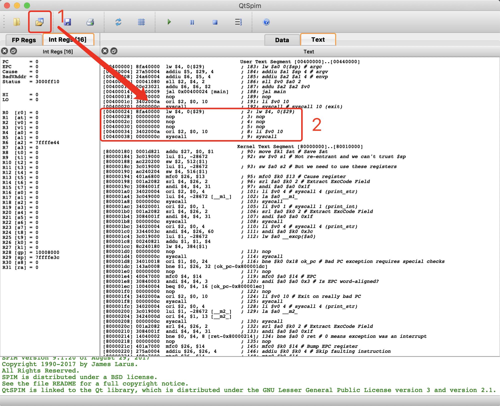
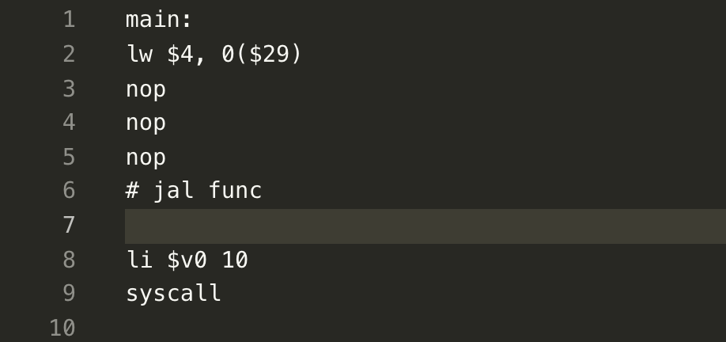

# CPP: Compiler for Pascal by Python

## To Do

### Test cases: test the AST and PLY

- [x] assign_demo.pas
- [x] calc.pas
- [x] comparisons.pas
- [x] const_fold.pas
- [x] for.pas
- [x] function.pa
- [x] if.pas
- [x] procedure.pas
- [x] repeat.pas
- [x] scope.pas
- [x] scopes.pas
- [x] stmt_list.pas
- [x] test_case.pas
- [x] test_div_mod.pas
- [ ] test_error.pas
- [x] testcase1.pas
- [x] types.pas
- [x] while.pas

## MIPS模拟器

MAC安装包：`./simulator/QtSpim.mpkg`

通过(1)处的`initialize and load`，加载`.asm`文件，然后就可以看到文件被加载到(2)处了

注意：在添加的`.asm`中得有一个`main:`标签，因为在默认代码中是跳转到`main`标签。

下面是`simulator/simulator_example.asm`的例子

可以参考[MIPS指令](http://www.mrc.uidaho.edu/mrc/people/jff/digital/MIPSir.html)

## Bug报备

直接群里说

## MIPS 指令参考

### 常用 MIPS 指令

https://www.cnblogs.com/grandyang/p/4010469.html

| **指令** | **功能**                                                     | **应用实例**      |
| -------- | ------------------------------------------------------------ | ----------------- |
| LB       | 从存储器中读取一个字节的数据到寄存器中                       | LB R1, 0(R2)      |
| LH       | 从存储器中读取半个字的数据到寄存器中                         | LH R1, 0(R2)      |
| LW       | 从存储器中读取一个字的数据到寄存器中                         | LW R1, 0(R2)      |
| LD       | 从存储器中读取双字的数据到寄存器中                           | LD R1, 0(R2)      |
| L.S      | 从存储器中读取单精度浮点数到寄存器中                         | L.S R1, 0(R2)     |
| L.D      | 从存储器中读取双精度浮点数到寄存器中                         | L.D R1, 0(R2)     |
| LBU      | 功能与LB指令相同，但读出的是不带符号的数据                   | LBU R1, 0(R2)     |
| LHU      | 功能与LH指令相同，但读出的是不带符号的数据                   | LHU R1, 0(R2)     |
| LWU      | 功能与LW指令相同，但读出的是不带符号的数据                   | LWU R1, 0(R2)     |
| SB       | 把一个字节的数据从寄存器存储到存储器中                       | SB R1, 0(R2)      |
| SH       | 把半个字节的数据从寄存器存储到存储器中                       | SH R1，0(R2)      |
| SW       | 把一个字的数据从寄存器存储到存储器中                         | SW R1, 0(R2)      |
| SD       | 把两个字节的数据从寄存器存储到存储器中                       | SD R1, 0(R2)      |
| S.S      | 把单精度浮点数从寄存器存储到存储器中                         | S.S R1, 0(R2)     |
| S.D      | 把双精度数据从存储器存储到存储器中                           | S.D R1, 0(R2)     |
| DADD     | 把两个定点寄存器的内容相加，也就是定点加                     | DADD R1,R2,R3     |
| DADDI    | 把一个寄存器的内容加上一个立即数                             | DADDI R1,R2,#3    |
| DADDU    | 不带符号的加                                                 | DADDU R1,R2,R3    |
| DADDIU   | 把一个寄存器的内容加上一个无符号的立即数                     | DADDIU R1,R2,#3   |
| ADD.S    | 把一个单精度浮点数加上一个双精度浮点数，结果是单精度浮点数   | ADD.S F0,F1,F2    |
| ADD.D    | 把一个双精度浮点数加上一个单精度浮点数，结果是双精度浮点数   | ADD.D F0,F1,F2    |
| ADD.PS   | 两个单精度浮点数相加，结果是单精度浮点数                     | ADD.PS F0,F1,F2   |
| DSUB     | 两个寄存器的内容相减，也就是定点数的减                       | DSUB R1,R2,R3     |
| DSUBU    | 不带符号的减                                                 | DSUBU R1,R2,R3    |
| SUB.S    | 一个双精度浮点数减去一个单精度浮点数，结果为单精度           | SUB.S F1,F2,F3    |
| SUB.D    | 一个双精度浮点数减去一个单精度浮点数，结果为双精度浮点数     | SUB.D F1,F2,F3    |
| SUB.PS   | 两个单精度浮点数相减                                         | SUB.SP F1,F2,F3   |
| DDIV     | 两个定点寄存器的内容相除，也就是定点除                       | DDIV Ｒ1,Ｒ2,Ｒ3  |
| DDIVU    | 不带符号的除法运算                                           | DDIVU Ｒ1,Ｒ2,Ｒ3 |
| DIV.S    | 一个双精度浮点数除以一个单精度浮点数，结果为单精度浮点数     | DIV.S F1,F2,F3    |
| DIV.D    | 一个双精度浮点数除以一个单精度浮点数，结果为双精度浮点数     | DIV.D F1,F2,F3    |
| DIV.PS   | 两个单精度浮点数相除，结果为单精度                           | DIV.PS F1,F2,F3   |
| DMUL     | 两个定点寄存器的内容相乘，也就是定点乘                       | DMUL Ｒ1,Ｒ2,Ｒ3  |
| DMULU    | 不带符号的乘法运算                                           | DMULU R1,R2,R3    |
| MUL.S    | 一个双精度浮点数乘以一个单精度浮点数，结果为单精度浮点数     | DMUL.S F1,F2,F3   |
| MUL.D    | 一个双精度浮点数乘以一个单精度浮点数，结果为双精度浮点数     | DMUL.D F1,F2,F3   |
| MUL.PS   | 两个单精度浮点数相乘，结果为单精度浮点数                     | DMUL.PS F1,F2,F3  |
| AND      | 与运算，两个寄存器中的内容相与                               | ANDＲ1,Ｒ2,Ｒ3    |
| ANDI     | 一个寄存器中的内容与一个立即数相与                           | ANDIＲ1,Ｒ2,#3    |
| OR       | 或运算，两个寄存器中的内容相或                               | ORＲ1,Ｒ2,Ｒ3     |
| ORI      | 一个寄存器中的内容与一个立即数相或                           | ORIＲ1,Ｒ2,#3     |
| XOR      | 异或运算，两个寄存器中的内容相异或                           | XORＲ1,Ｒ2,Ｒ3    |
| XORI     | 一个寄存器中的内容与一个立即数异或                           | XORIＲ1,Ｒ2,#3    |
| BEQZ     | 条件转移指令，当寄存器中内容为0时转移发生                    | BEQZ R1,0         |
| BENZ     | 条件转移指令，当寄存器中内容不为0时转移发生                  | BNEZ R1,0         |
| BEQ      | 条件转移指令，当两个寄存器内容相等时转移发生                 | BEQ R1,R2         |
| BNE      | 条件转移指令，当两个寄存器中内容不等时转移发生               | BNE R1,R2         |
| J        | 直接跳转指令，跳转的地址在指令中                             | J name            |
| JR       | 使用寄存器的跳转指令，跳转地址在寄存器中                     | JR R1             |
| JAL      | 直接跳转指令，并带有链接功能，指令的跳转地址在指令中，跳转发生时要把返回地址存放到R31这个寄存器中 | JAL R1 name       |
| JALR     | 使用寄存器的跳转指令，并且带有链接功能，指令的跳转地址在寄存器中，跳转发生时指令的放回地址放在R31这个寄存器中 | JALR R1           |
| MOV.S    | 把一个单精度浮点数从一个浮点寄存器复制到另一个浮点寄存器     | MOV.S F0,F1       |
| MOV.D    | 把一个双精度浮点数从一个浮点寄存器复制到另一个浮点寄存器     | MOV.D F0,F1       |
| MFC0     | 把一个数据从通用寄存器复制到特殊寄存器                       | MFC0 R1,R2        |
| MTC0     | 把一个数据从特殊寄存器复制到通用寄存器                       | MTC0 R1,R2        |
| MFC1     | 把一个数据从定点寄存器复制到浮点寄存器                       | MFC1 R1,F1        |
| MTC1     | 把一个数据从浮点寄存器复制到定点寄存器                       | MTC1 R1,F1        |
| LUI      | 把一个16位的立即数填入到寄存器的高16位，低16位补零           | LUI R1,#42        |
| DSLL     | 双字逻辑左移                                                 | DSLL R1,R2,#2     |
| DSRL     | 双字逻辑右移                                                 | DSRL R1,R2,#2     |
| DSRA     | 双字算术右移                                                 | DSRA R1,R2,#2     |
| DSLLV    | 可变的双字逻辑左移                                           | DSLLV R1,R2,#2    |
| DSRLV    | 可变的双字罗伊右移                                           | DSRLV R1,R2,#2    |
| DSRAV    | 可变的双字算术右移                                           | DSRAV R1,R2,#2    |
| SLT      | 如果R2的值小于R3，那么设置R1的值为1，否则设置R1的值为0       | SLT R1,R2,R3      |
| SLTI     | 如果寄存器R2的值小于立即数，那么设置R1的值为1，否则设置寄存器R1的值为0 | SLTI R1,R2,#23    |
| SLTU     | 功能与SLT一致，但是带符号的                                  | SLTU R1,R2,R3     |
| SLTUI    | 功能与SLT一致，但不带符号                                    | SLTUI R1,R2,R3    |
| MOVN     | 如果第三个寄存器的内容为负，那么复制一个寄存器的内容到另外一个寄存器 | MOVN R1,R2,R3     |
| MOVZ     | 如果第三个寄存器的内容为0，那么复制一个寄存器的内容到另外一个寄存器 | MOVZ R1,R2,R3     |
| TRAP     | 根据地址向量转入管态                                         |                   |
| ERET     | 从异常中返回到用户态                                         |                   |
| MADD.S   | 一个双精度浮点数与单精度浮点数相乘加，结果为单精度           |                   |
| MADD.D   | 一个双精度浮点数与单精度浮点数相乘加，结果为双精度           |                   |
| MADD.PS  | 两个单精度浮点数相乘加，结果为单精度                         |                   |

### 系统调用

https://blog.csdn.net/wu_cai_/article/details/45034163

| Service                               | \$v0 | 参数 / 返回值                                      |
| :------------------------------------ | :-------------------------- | :----------------------------------------------------------- |
| print_int                 | 1    | 参数：将要打印的整型赋值给 \$a0       |
| print_float               | 2    | 参数：将要打印的浮点赋值给 \$f12       |
| print_double                | 3                   | 参数：将要打印的双精度赋值给 \$f12    |
| print_string                          | 4                    | 参数：将要打印的字符串的地址赋值给 \$a0 |
| read_int                              | 5    | 返回值：将读取的整型赋值给 \$v0 |
| read_float                    | 6    | 返回值：将读取的浮点赋值给 \$f0 |
| read_double                 | 7    | 返回值：将读取的双精度赋值给 \$v0 |
| read_string                 | 8    | 返回值：将读取的字符串地址赋值给 \$a0，将读取的字符串长度赋值给 \$a1 |
| sbrk应该同C中的sbrk()函数动态分配内存 | 9    | 参数：\$a0 需要分配的空间大小（单位目测是字节 bytes）；返回值：将分配好的空间首地址给 \$v0 |
| exit                              | 10   |  |