# Report 编译原理项目报告

## CPP: Compile for Pascal by Python 


| 邱兆林     | 刘洪甫 | 任宇凡     |
| ---------- | ------ | ---------- |
| 3160105287 | 3160104769 | 3160104704 |


## 目录

[TOC]


## 总体架构

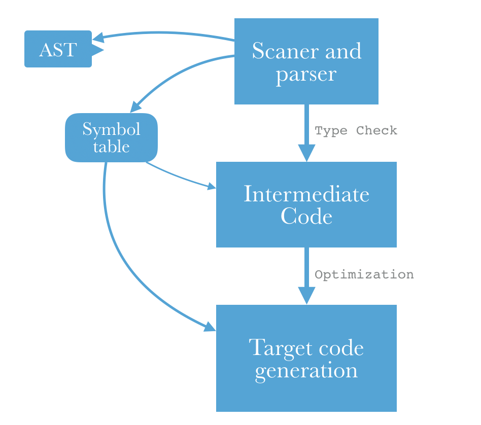

如上图所示，在CPP(Compiler for Pascal in Python)中，我们实现了从pascal代码到最终可执行的MIPS代码之间的编译过程。最终获得的MIPS代码可以在Mips模拟器上直接运行并且获得Pascal代码想要的结果。

在处理的过程中首先是通过词法和语法分析，从pascal代码构建抽象语法树，在这个过程中也完成了符号表的构建和中间代码的生成。在中间代码的生成过程中进行了类型检查。当完成了中间代码的生成和符号表的构建之后开始目标代码的生成。

和一般使用的通过LLVM的方式实现中间代码的生成到目标代码的生成的方法不同，在我们的工程中我们自己实现了中间代码的生成到目标代码的生成工作。这也就意味着我们需要自己维护运行时环境，这包括了跳转到函数过程中访问链和控制链的维护，也包括了栈内存的分配，返回地址的保护，也包括从函数返回过程中，恢复现场(恢复寄存器)，和保存返回值的工作。

最终我们将生成的MIPS代码放在MIPS模拟器上直接运行，然后得到了正确的结果。

在本报告的倒数第二个章节，我们对老师提供的测试样例，以及我们自己编写的一些测试样例进行了测试，均得到了正确的结果。我们还会对这样的结果进行分析。在最后一个章节我们会对我们的编译器提出可能的优化与展望。

## 词法分析

词法分析部分部分的主要功能是将输入分析的pascal文本处理成一个一个的token。这是编译器处理的第一个环节，通过词法分析后续过程就不需要再面对原始文本，而是一个一个有名字，有类型的token，这位后续的分析提供了很大的便利性。

举个例子，对于普通的变量名NAME，我们可以如下地通过ply.lex库对其通过正则表达式进行定义，这个正则表达式描述了一个以字母开头，后面有字母也可能有数字的一个token，这也就是NAME。

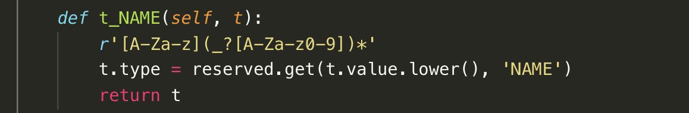

下面这个例子是实数的，实数的重要组成是中间的小数点，前面的d表示的是数字。

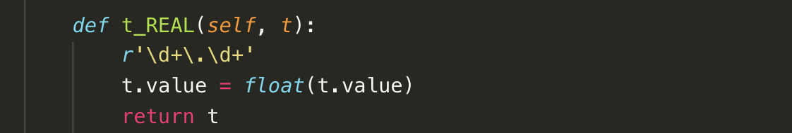

### 优先级问题

关于优先级问题ply.lex的处理方法和LEX的方法是类似的，都是通过定义的顺序来决定优先级，并且在实际匹配中采用最长匹配原则。

### ply.lex

ply.lex是一个完全通过Python实现的词法分析库，可以通过Python语言，像C语言使用LEX一样使用词法分析功能。


### lex测试

```pascal
program test3; 
var 
    A : integer; 

    procedure ScopeInner; 
    var A : integer; 
        begin
        A := 10; 
……
```

上面是一段pascal代码，这是不完整的，但是可以用于说明。

```
LexToken(PROGRAM,'program',1,0)
LexToken(NAME,'test3',1,8)
LexToken(SEMI,';',1,13)
LexToken(VAR,'var',2,16)
LexToken(NAME,'A',3,22)
LexToken(COLON,':',3,24)
LexToken(SYS_TYPE,'integer',3,26)
LexToken(SEMI,';',3,33)
LexToken(PROCEDURE,'procedure',5,38)
LexToken(NAME,'ScopeInner',5,48)
LexToken(SEMI,';',5,58)
LexToken(VAR,'var',6,62)
LexToken(NAME,'A',6,66)
LexToken(COLON,’:’,6,68)
```

上面这些Token就是从上面的pascal代码生成的。

## 语法分析

语法分析过程主要有自顶向下和自底向上两种类型。自顶向下方法以LL(1)分析为代表；自底向上分析方法以LR(1)，SLR(1), LALR(1)分析为代表。其中，既有足够强大的表达能力，又足够简单的是LALR(1)分析。在LALR(1)分析中向前展望一个符号。而由于有了YACC语法分析工具这样的部件可以使用，编程者不再需要自己去处理语法分析，而是传入文法的产生式，然后自动生成语法分析的结果：抽象语法树。

这部分的代码在`CPP_yacc.py`中，

如下例中，我们希望写出从routine头，主标签，以及routine内容到routine的规约。于是我们的书写过程如下所示。这个里面值得关注的一点是和一般的Python代码逻辑不通，这里中间的注释内容才是需要的。(Python中三个连续的引号是注释)

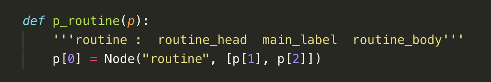

在下面一个例子中我们希望写出程序头的产生式。而这一个产生式也是在下面介绍ply.yacc的过程中使用到的例子。

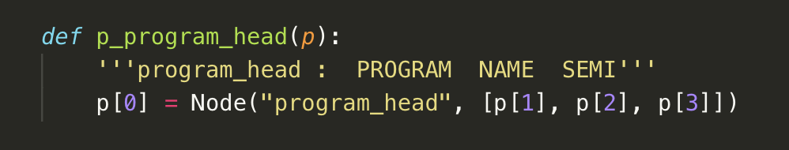

### ply.yacc

ply.yacc方法是对于Python支持的语法分析库，通过ply.yacc我们可以通过Python语言像C语言使用YACC工具一样简单地使用语法分析功能。

而ply.yacc比较出色的一点在于其更加强大的debug能力。

首先ply.yacc可以生成文法的所有的产生式，如下图所示(这一步基本上是对于我们提供的产生式的优化)

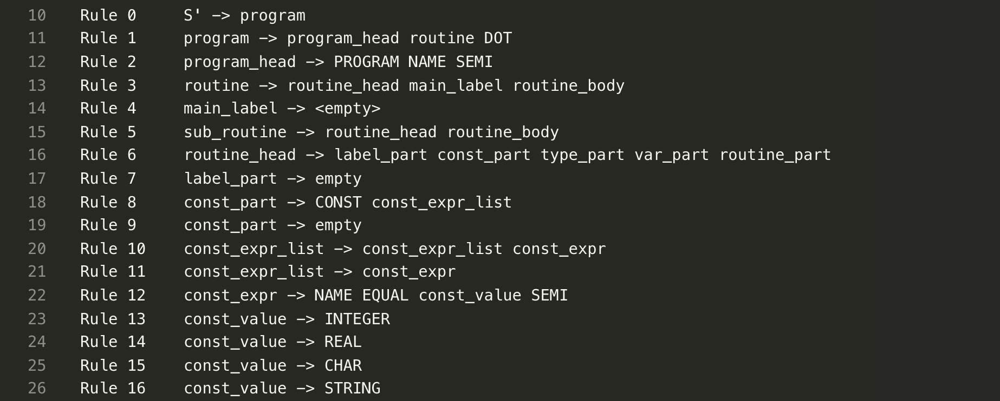

第二是通过开启debug模式我们可以在处理的过程中看到语法分析的全过程。这包括在处理的过程中栈是怎么变化的，采用了什么样的规约，或者移进操作。

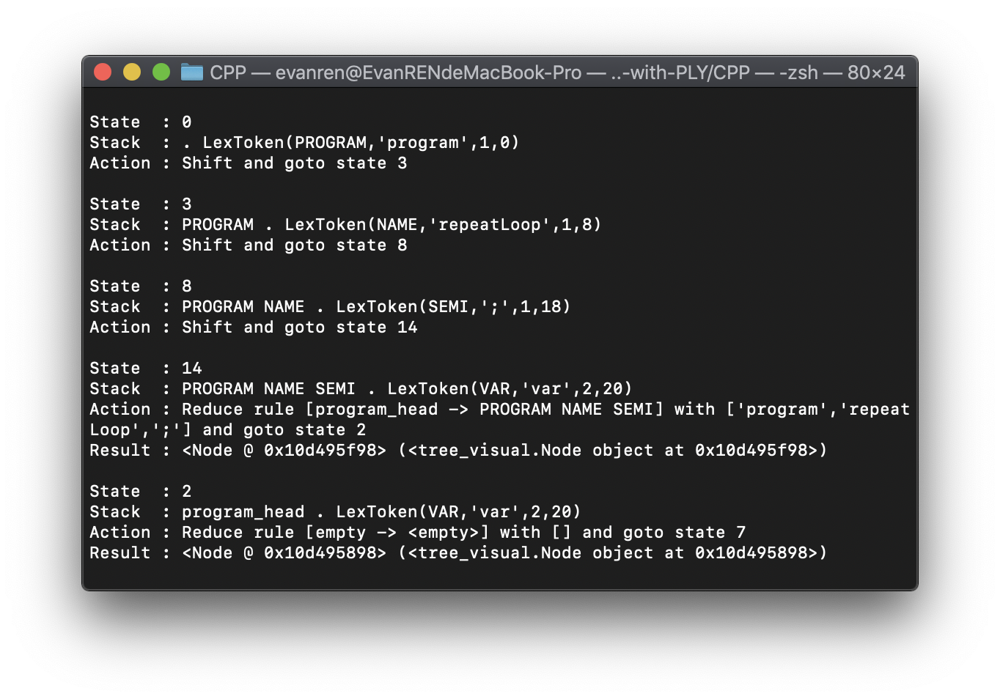

在上图中我们可以看到语法分析在处理一个pascal程序最开始的时候。首先遇到了PROGRAM这个保留字（注意其中的点号，这个点号和我们在编译原理课程中学到的分割输入和栈的点号意义完全相同），然后采取了移进操作。然后获取到了一个名为`repeatLoop`的名字，这个名字显然就是函数名了。然后接着又得到了一个分号，得到分号之后通过规约操作`[program_head -> PROGRAM NAME SEMI] with ['program','repeatLoop',';']`将刚刚收到的所有内容规约成一个`program_head`。这样就完成了函数头部的处理，往往一个稍微长的pascal代码的处理过程，操作数目非常巨大，但是不可否认这样的直观的栈和输入流，可以给代码的编写带来便利。

### yacc测试

```
A := 20000; 
```

上面是一条pascal的语句，其中完成了对A变量的赋值操作。而下面是当栈顶是赋值符号，然后输入一个20000的语法分析过程。可以看出这个20000在词法分析的过程中已经被处理成了一个整数Integer。然后程序采用的是移进，将integer读入到栈顶，然后展望到分号。

当看到分号之后程序采用了将integer规约成const_value的规约操作，然后将这个const_value进一步变成factor。这和我们的预想是完全一样的。

```
State  : 61
Stack  : program_head routine_head BEGIN stmt_list NAME ASSIGN . LexToken(INTEGER,20000,23,287)
Action : Shift and goto state 77

State  : 77
Stack  : program_head routine_head BEGIN stmt_list NAME ASSIGN INTEGER . LexToken(SEMI,';',23,292)
Action : Reduce rule [const_value -> INTEGER] with [20000] and goto state 76
Result : <Node @ 0x10a5a8a20> (<tree_visual.Node object at 0x10a5a8a20>)

State  : 76
Stack  : program_head routine_head BEGIN stmt_list NAME ASSIGN const_value . LexToken(SEMI,';',23,292)
Action : Reduce rule [factor -> const_value] with [<Node @ 0x10a5a8a20>] and goto state 71
Result : <Node @ 0x10a5d3b38> (<tree_visual.Node object at 0x10a5d3b38>)

State  : 71
Stack  : program_head routine_head BEGIN stmt_list NAME ASSIGN factor . LexToken(SEMI,';',23,292)
Action : Reduce rule [term -> factor] with [<Node @ 0x10a5d3b38>] and goto state 69
Result : <Node @ 0x10a5d3b00> (<tree_visual.Node object at 0x10a5d3b00>)
```

## 抽象语法树的生成

抽象语法树的生成过程应该是在语法分析的过程中完成的，而在我们的代码实现中确实也是这样的。

由于在语法分析的过程中我们可以对产生式定义相应的动作，所以在这个过程中我们也完成了将抽象语法树的儿子节点添加到父节点的工作。这个过程中我们需要使用到节点的定义。和节点的函数。这部分的代码在`tree_visual.py`中。

#### Node定义

```python
class Node(object):
    def __init__(self, t, c):
        self.type = t
        self.children = c
        self.id = "%s: %08d" % (
            self.type, round(random.random() * 100000000))
```

Node定义中有三个成员

- type：表示类型，Node的类型有很多中种，一般是直接采用产生式的左端，比如说`if_stmt`这样的。这个type将会作为名字的一部分绘制到结点中。
- Children：一个存放儿子节点的列表。在children中放置各种不同的儿子节点。
- id：id中存放的是type加上一个随机数。这样做的目的是为了克服在绘制抽象语法树的过程中由于名字重复而绘制混乱的问题。

例如在下面的代码中我们将一句if语句的儿子全部添加到父亲节点中

```python
def p_if_stmt_with_else(p):
    '''if_stmt :  IF  expression  THEN  if_label1  stmt  if_label2  ELSE  stmt  if_label3'''
    #     0       1       2        3        4       5       6        7     8        9
    p[0] = Node("if_stmt", [p[2], p[5], p[8]])
```

又比如下面的一行对`goto`语句的产生式，我们将跳转到的行号写在父亲结点里面

```python
def p_goto_stmt(p):
    '''goto_stmt :  GOTO  INTEGER'''
    p[0] = Node("goto_stmt", [p[2]])
```

在具体的绘制过程中我们需要对抽象语法树进行一次变量，然后将每一条边添加到我们即将绘制的图片中，最后将图片输出。

### pydot库

pydot是一个Python的绘图库，通过这个库我们可以比较方便地完成抽象语法树的绘制工作。

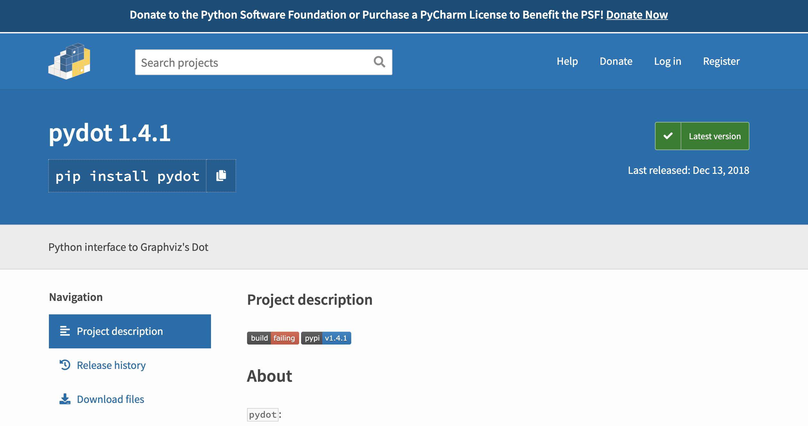

### 测试抽象语法树的绘制

比如说对于`cases.pas`的例子，它的代码如下

```pascal
PROGRAM Greeting;

CONST
x = 4;

var y : integer;
   
BEGIN

   CASE x OF
    1: y := x + 1;
    2: y := x + 2;
    3: y := x + 3;
    END;
    BEGIN
        y := x + 5;
    END;

   WRITELN(y);
END.
```

绘制出来的抽象语法树如图所示

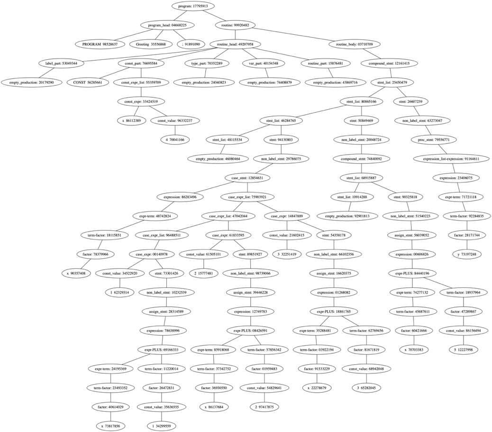


当我们关注其中的case语句的时候，可以将图片放大

```pascal
   CASE x OF
    1: y := x + 1;
    2: y := x + 2;
    3: y := x + 3;
    END;
```

其对应的部分是，

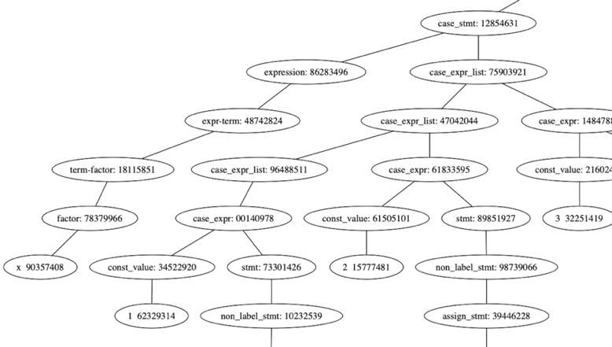

可以看出最左边的是case语句的`x`，而后面的每一条分支，其中的第一个分支是1，2，3，这分别是`case`中的几种选择情况。而后面具体的表达式应该是`x+1`等。这符合了我们的预期。

## 语义分析(这个如果没有的话就写一下类型检查吧)

### 语义信息的定义

在构建语法树的同时，在节点中可以定义传递语义的信息。比如下面的一段定义了常量值与类型的语义。

```python
def p_const_value(p):
    '''const_value :  INTEGER  |  REAL  |  CHAR
                   |  SYS_CON  |  true  | false
    '''
    p[0] = Node("const_value", p[1])

    p[0].value = p[1]

    if type(p[1]) == int:
        p[0].type = 'integer'

    elif type(p[1]) == float:
        p[0].type = 'real'

    elif type(p[1]) == str:
        p[0].type = 'char'

    if str(p[1]).lower() == 'true':
        p[0].type = 'boolean'
        p[0].value = True

    if str(p[1]).lower() == 'false':
        p[0].type = 'boolean'
        p[0].value = False
```

在这段分析中，`p[0]` 表示该节点，通过对其属性 type 和 value 复制来定义它的语义。

### 语义信息的传递

在自底向上的分析过程中，当子节点的语义被定义后，父节点就可以访问子节点的语义信息。例如下面一段保存一个 name 的 list。

```python
def p_name_list(p):
    '''name_list :  name_list  COMMA  NAME
                 |  NAME'''
    if len(p) == 4:
        p[0] = Node("name_list", [p[1]])
        p[0].list = p[1].list + [p[3]]
    else:
        p[0] = Node("name_list", [p[1]])
        p[0].list = [p[1]]
```

符号定义后，对应的符号类的对象也会被定义在语义信息中，随着节点传递。

```python
def p_factor_name(p):
    '''factor :  NAME'''
    p[0] = Node('factor', [p[1]])

    symbol = table.get_identifier(p[1])

    if symbol.var_function == 'function':
        if table.scope().name.endswith('.' + symbol.name):
            symbol = table.get_identifier('_return')

    p[0].symbol = symbol
```

### 类型检查

符号的类型随着符号保存在节点中。类型检查需要时，只需要检查对应的类型即可。让类型不匹配时，抛出一个异常。

```python
def p_term(p):
    '''term :  term  MUL  factor
                |  term  DIV  factor
                |  term  MOD  factor
                |  term  AND  factor
                |  factor'''
    if len(p) == 2:
        p[0] = Node("term-factor", [p[1]])

        if hasattr(p[1], 'symbol'):
            p[0].symbol = p[1].symbol
        else:
            p[0].value = p[1].value
            p[0].type = p[1].type

    else:
        p[0] = Node("term-term", [p[1], p[3]])

        if p[2] == '*':
            if type_of_node(p[1]) == 'real' or type_of_node(p[3]) == 'real':
                symbol = table.get_temp('real')
            else:
                symbol = table.get_temp('integer')

        elif p[2] == '/':
            symbol = table.get_temp('real')

        elif p[2].lower() in ['div', 'mod']:
            if type_of_node(p[1]) != 'integer':
                raise ValueError('Type mismatch: %s' % type_of_node(p[1]))
            if type_of_node(p[3]) != 'integer':
                raise ValueError('Type mismatch: %s' % type_of_node(p[3]))
            symbol = table.get_temp('integer')

        elif p[2].lower() == 'and':
            symbol = table.get_temp('boolean')

        emit(p[2], symbol, p[1], p[3])
        p[0].symbol = symbol
```

这段表示了乘法、除法、以及取模运算上的类型检查。当类型不是 integer 时会抛出异常。

## 符号表

符号表在生成抽象语法树的过程中建立。符号表的总体结构如下图所示。

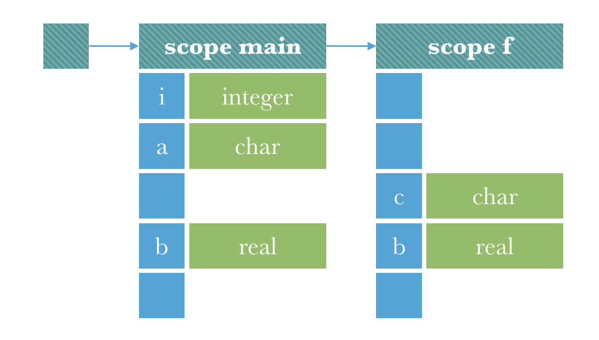

### 符号类

符号类是用来存放一个符号的。所有的符号都是符号类的一个对象。它的结构按照下表定义。

| 属性         | 含义                         | 说明                                                         |
| ------------ | ---------------------------- | ------------------------------------------------------------ |
| name         | 符号名                       | 转化为小写                                                   |
| type         | 符号类型                     | 可以是基础类型 'integer', 'real', 'char', 'boolean'，复杂类型 'array', 'record'，或者是已定义的其他类型。 |
| var_function | 用于区分该符号是变量还是函数 | 'var', 'const', 'function', 'procedure', 'type'              |
| offset       | 偏移量                       | 指该符号在其作用域内的偏移量                                 |
| params       | 参数                         | 复杂类型或函数时用于保存额外信息                             |
| size         | 大小                         | 初始化时自动计算                                             |
| reference    | 是否为引用                   |                                                              |

其中，params 只当 const、function、procedure、array、record 时有参数。如果是 function，那么 params 依照一下的 list 传递参数列表：

```
[
    (arg1, type1),
    (arg2, type2),
    ...
]
```
如果是 array，那么 params 依照以下的 dict 传递数据类型和范围：
```
{
    'data_type': 'integer',
    'dimension': [(0, 100), (0, 1000), ...]
}
```
如果是 record 那么 params 依照以下的 list 传递结构：（其中 type 可能是复杂类型）
```
[
    (name1, type1),
    (name2, type2),
    ...
]
```
如果是 const 那么 params 传递常量的值。

### 作用域类

本编译器的符号表按照不同的作用域分别保存。每一个作用域用一个作用域类的对象来记录。

| 属性      | 含义                         | 说明                                                         |
| --------- | ---------------------------- | ------------------------------------------------------------ |
| name      | 作用域名                     | 转化为小写，用 '.' 连接父作用域名，例如 'main.f'             |
| width     | 宽度                         | 可以是基础类型 'integer', 'real', 'char', 'boolean'，复杂类型 'array', 'record'，或者是已定义的其他类型。 |
| symbols   | 符号 | 'var', 'const', 'function', 'procedure', 'type'              |
| temps | 偏移量                       | 指该符号在其作用域内的偏移量                                 |
| labels | 参数                         | 复杂类型或函数时用于保存额外信息                             |

当定义一个新符号时，首先初始化一个符号类，并且把当前作用域宽度传递给符号类的构造函数，这样符号类中就可以保存正确的偏移量信息。接着，把它添加到 symbols 或者 temps 中，最后更新作用域类的 width。

当定义一个 label 时，生成一个字符串，并且把它添加到 labels 集合中。

### 符号表类

符号表类是符号表的接口类，提供接口给编译器的其他部分使用。符号表类使用栈来保存作用域。当有新的一层作用域时，将其入栈。当作用域结束时，将其出栈。符号表内定义了以下方法。

| 方法                       | 含义                               |
| -------------------------- | ---------------------------------- |
| scope()                    | 获取当前作用域                     |
| get_identifier(name)       | 从符号表中查找一个符号             |
| get_identifier_scope(name) | 从符号表中查找一个符号所处的作用域 |
| define(name, type, ...)    | 在当前作用域定义一个符号           |
| get_temp(type, ...)        | 在当前作用域获取一个临时符号       |
| get_label()                | 在当前作用域获取一个 label         |
| add_scope(name, type)      | 增加一层作用域                     |
| del_scope()                | 删除一层作用域                     |

### 符号表使用样例

引入符号表模块后，使用上面定义的结构对符号表进行操作。运行以下的测试样例：

```python
t = Table()
t.define('IDCard', 'record', 'type', [
    ('ID', 'integer'),
    ('name', 'char')
])
t.add_scope('f', 'function', 'integer')
t.define('Student', 'record', 'type', [
    ('name', 'char'),
    ('card', 'IDCard')
])
t.define('CircleLin', 'Student', 'var')
t.define('students', 'array', 'var', {
    'data_type': 'Student',
    'dimension': [(1, 100)]
})
print(t)
```

会得到下面的符号表：

```python
Table([
    Scope(`main`, symbols=[
        Symbol(`idcard`, record, type, 0, [
            ('ID', 'integer'), 
            ('name', 'char')
        ])
    ], temps=[]),
    Scope(`main.f`, symbols=[
        Symbol(`student`, record, type, 0, [
            ('name', 'char'),
            ('card', 'IDCard')
        ]),
        Symbol(`circlelin`, student, var, 0),
        Symbol(`students`, array, var, 12, {
            'data_type': 'Student', 
            'dimension': [(1, 100)]
        })
    ], temps=[])
])
```

## 中间代码生成
我们的中间代码使用的是自己定义的三地址代码，形式为（operation, lhs, op1, op2)

具体定义规则如下：
| Operation 操作符 | lhs结果 | op1       | Op2     |
| ---------------- | ------- | --------- | ------- |
| +\-\*\/          | 结果    | 操作数1   | 操作数2 |
| PRINT            |         | 参数      |         |
| PRINTLN          |         |           |         |
| PARAM            |         | 参数      |         |
| CALL(返回赋值)   | 结果    | 调用label |         |
| CALL(返回不赋值) |         | 调用label |         |
| LOADREF          | 结果    | 符号      | index   |
| STOREREF         | 值      | 符号      | index   |
| SLT              | 结果    | 操作数1   | 操作数2 |
| BNE              | Label   | 操作数1   | 操作数2 |
| BEQ              | Label   | 操作数1   | 操作数2 |
| JMP              | Label   |           |         |
| LABEL            | Label   | scope 名  |         |
| INPUT            | 保存值  |           |         |
| RETURN           | jieguo  | scope 名  |         |
| NOT              | 结果    | 操作数    |         |
| MOD              |         |           |         |

中间代码的生成过程包含在parsing过程中，我们定义了一个类ThreeAC用于存放三地址代码，并封装了emit函数用于parsing时生成中间代码。

例如下面这段代码，这是一段常数赋值的语法。在解析到这里的时候我们把三地址代码emit出来，赋值语句用加法替代，结果是symbol，常量是该节点中const_value对应的位置
```python
def p_const_expr(p):
    """const_expr : NAME EQUAL const_value SEMI"""
    p[0] = Node("const_expr", [p[1], p[3]])

    symbol = table.define(p[1], p[3].type, 'const', p[3].value)
    emit('+', symbol, p[3], 0)
```

## 寄存器分配
在生成中间代码之后，将中间代码转化为目标代码的过程中，需要使用到某个变量，需要给变量分配寄存器或者存到内存里，但是我们知道访问寄存器的速度显然是比直接访问内存快的，所以我们需要给变量分配寄存器。因此我们定义了寄存器分配类AllocateRegister

| 属性      | 含义                         | 说明                                                         |
| --------- | ---------------------------- | ------------------------------------------------------------ |
| symtabel | 符号表     | 指parsing结束后存有scope信息的表 |
| code     | 三地址代码  | 指parsing结束后存放在三地址类的代码 |
| symbol_register  | 符号寄存器表 | 用于记录存放每个变量对应的寄存器的字典  |
| unused_register_list | 未使用寄存器表 | 全局定义的未使用寄存器表，包括mips里32个寄存器 |
| basic_blocks | 基本块 | 用于记录划分基本块后每个基本块的起始位置信息 |
| next_use | 下一状态表 | 用于记录每个基本块中每个状态对应的下一状态寄存器使用情况 |

### 基本块划分

基本块指连续三地址状态的最大序列，其中控制流只能在块的第一个语句中进入，并在最后一个语句中离开。
基于此我们知道，三地址码中以下几种情况对应了基本块的划分：

- 跳转指令的下一个指令
- 跳转指令的目标指令
- 自带lable的指令
- 程序的第一条指令

```python
block_part = []
# 首指令
block_part.append(0)

for i in range(len(self.code)):
    code_line = self.code[i]
    # 跳转指令
    if code_line[1].lower() in ['bne', 'beq', 'jmp']:
        if code_line[2] != None:
            block_part.append(self.label_line(code_line[2]))
        # 跳转指令下一条指令
        if i != len(self.code)-1:
            block_part.append(self.code[i+1][0])
    
    # 自带label指令
    elif code_line[1].lower() in ['label']:
        block_part.append(code_line[0])
    elif code_line[1].lower() in ['call', 'return'] and i != len(self.code)-1:
        block_part.append(self.code[i+1][0])
```

最后去除行号中所有重复的值，然后排序，从而得到基本块的划分。
测试样例6(上面是中间代码，下面是基本块划分结果)：

```
# 0 LABEL gcd main.gcd None
# 1 = Symbol(`_t000000`, boolean, var, 12) Symbol(`b`, integer, var, 4) 0
# 2 BEQ _l000000 Symbol(`_t000000`, boolean, var, 12) False
# 3 + Symbol(`_return`, integer, var, 8, [('a', 'integer', False), ('b', 'integer', False)]) Symbol(`a`, integer, var, 0) 0
# 4 JMP _l000001 None None
# 5 LABEL _l000000 None None
# 6 MOD Symbol(`_t000001`, integer, var, 16) Symbol(`a`, integer, var, 0) Symbol(`b`, integer, var, 4)
# 7 PARAM None Symbol(`b`, integer, var, 4) None
# 8 PARAM None Symbol(`_t000001`, integer, var, 16) None
# 9 CALL Symbol(`_t000002`, integer, var, 20) gcd main
#10 + Symbol(`_return`, integer, var, 8, [('a', 'integer', False), ('b', 'integer', False)]) Symbol(`_t000002`, integer, var, 20) 0
#11 LABEL _l000001 None None
#12 RETURN Symbol(`_return`, integer, var, 8, [('a', 'integer', False), ('b', 'integer', False)]) main.gcd None
#13 LABEL main None None
#14 PARAM None 9 None
#15 PARAM None 36 None
#16 CALL Symbol(`_t000000`, integer, var, 4) gcd main
#17 PARAM None 3 None
#18 PARAM None 6 None
#19 CALL Symbol(`_t000001`, integer, var, 8) gcd main
#20 * Symbol(`_t000002`, integer, var, 12) Symbol(`_t000000`, integer, var, 4) Symbol(`_t000001`, integer, var, 8)
#21 + Symbol(`ans`, integer, var, 0) Symbol(`_t000002`, integer, var, 12) 0
#22 PRINT None Symbol(`ans`, integer, var, 0) None
#23 PRINTLN None None None

# basic_blocks
[(0, 2), (3, 4), (5, 9), (10, 10), (11, 12), (13, 16), (17, 19), (20, 23)]
```

### 分配策略

寄存器分配算法——getReg函数设计：

如果该变量已经被分配到某个寄存器中，直接使用该寄存器，否则在未使用寄存器中分配一个。如果已经没有未使用寄存器，那么计算选择一个最小替换代价的寄存器。

```python
if op in self.symbol_register:
    reg = self.symbol_register[op]

elif len(self.unused_register) > 0:
    reg = self.unused_register[0]
    self.unused_register.remove(reg)
    self.symbol_register[op] = reg

else:
    var = self.get_block_minuse(op, block_index, line_num)
    reg = self.symbol_register[var]
    del self.symbol_register[var]
```

其中，在寄存器数量不够的时候，用到的最小替换代价策略函数get_block_minuse的设计思路如下:

将每个基本块中，从块中最后一行到块中第一行每行的三地址码行号信息存入next_use中，靠前行的变量的行号可以替代该变量出现在的靠后行的行号，最后将链表反转。
```python
line = {}
for i in range(len(code), 0, -1):
    code_line = code[i-1]
    line_num, _, lhs, op1, op2 = code_line

    if type(lhs) == Symbol:
        line[lhs] = float("inf")
    if type(lhs) == Symbol:
        line[op1] = line_num
    if type(lhs) == Symbol:
        line[op2] = line_num
    preline = line.copy()
    self.next_use[block_index].append(preline)

self.next_use[block_index] = list(reversed(self.next_use[block_index]))
```

然后计算最小替换代价的get_block_minuse函数，选择出在该block后面行中没有出现（inf）的变量或者出现在最后行（行号最大）的变量对应的寄存器，即为待替换的寄存器。
```python
def get_block_minuse(self, op, block_index, line_num):
    start = self.basic_blocks[block_index][0]
    next_use_block = self.next_use[block_index][line_num+1-start]
    max_line = 0 # 行号
    max_sym = ''

    for sym in next_use_block.keys():
        if self.symbol_register[sym] != '' and float(next_use_block[sym]) > max_line:
            max_line = float(next_use_block[sym])
            max_sym = sym

    return max_sym
```

需要注意的是在寄存器分配后使用前，要寄存器的值从内存读入，同理，在一个block或者scope结束后，或者寄存器值被替换前，也需要把这些寄存器中储存的变量值存回变量在内存中的位置。因此我们设计了如下load_mem, store_mem函数：

```python
def load_mem(self, op, reg, scope_stack):
    if not op.reference:
        off, code = self.offset(op, scope_stack)
        if code is None:
            return "lw {}, {}($fp)".format(reg, -off)
        else:
            return '\n'.join(code + ["lw {}, {}($t9)".format(reg, -off)])
    else:
        return "lw $t9, {}($fp) \nlw {}, 0($t9)".format(-op.offset, reg)

def store_mem(self, op, reg, scope_stack):
    if not op.reference:
        off, code = self.offset(op, scope_stack)
        if code is None:
            return "sw {}, {}($fp)".format(reg, -off)
        else:
            return '\n'.join(code + ["sw {}, {}($t9)".format(reg, -off)])
    else:
        return "lw $t9, {}($fp) \nsw {}, 0($t9)".format(-op.offset, reg)
```

## 代码优化

代码优化部分主要为涉及常数计算的表达式优化

当两个运算符都为常数时，直接在高级程序里计算，而不用在mips汇编里运算，再将运算结果赋值或者继续进行别的操作。如果控制流的判断条件是常数运算，那么则直接根据运算结果判断是否跳转，如果跳转则添加jmp指令和目标label，否则直接跳过改语句。

处理二元运算时：
```python
const_type = [int, str, bool]
if type(op1) in const_type and type(op2) in const_type:
    const = eval(str(op1)+' '+operation.lower()+' '+str(op2))
    if type(const) == bool:
        const = [False, True].index(const)
    self.asmcode.append('addi'+' '+reg_lhs+', '+'$0, '+str(const))
```

处理跳转时：
```python
if type(op1) in const_type and type(op2) in const_type:
    if operation.lower() == 'beq':
        if op1 == op2:
            self.asmcode.append('j {}'.format(reg_lhs))
    if operation.lower() == 'bne':
        if op1 != op2:
            self.asmcode.append('j {}'.format(reg_lhs))
```

## 代码生成

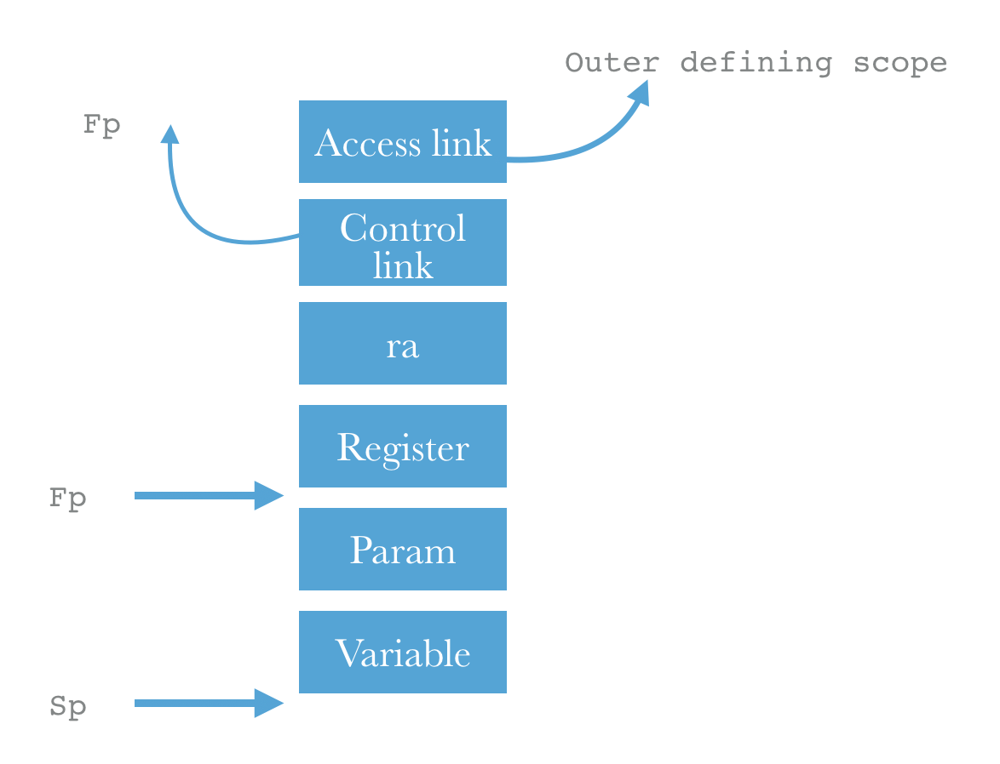

> 从中间代码到目标代码的生成过程，虽然可以使用LLVM框架等简单办法，但是考虑之后我们还是选择了自己手动地编写从中间代码到目标代码的转换，其中包括复杂的运行时环境的维护。

### 堆栈管理与函数跳转

代码生成中比较复杂的是运行环境的维护，并且需要管理寄存器和程序运行的堆栈。

由于我们的spl程序运行环境是基于栈的动态环境，所以在进入函数时需要(1)分配足够的栈空间给局部变量；(2)更新返回地址；(3)更新控制链和访问链；(4)保存寄存器的状态以便在退出函数时恢复；(5)将函数调用的参数进行压栈处理，以便在函数中使用。接下来我们将会跟着代码，详细地介绍其中的每一个环节。

#### 访问链的处理

访问链的处理较为复杂，需要分情况讨论。因为访问链不总是指向该函数的调用者，这个关系应该是在定义时就确定的。举个例子，

```pascal
procedure hello(x: real);

    var y: integer;
    procedure hello_2(xx: real);
        var yy: integer;
        begin
        g();
        end;
        
    begin
    writeln(x+y);
    end;
```

在上面代码段中，`hello_2`这段例程中就可以访问外部的`hello`例程中的变量，比如`y`。但是在`hello_2`中调用函数`g()`。函数`g()`中就不可以访问到`hello_2`的变量，更不能访问到`hello`中的变量。

于是我们想到了一种区分两种情况的办法，因为我们通过定义(也就是scope)可以确定`hello_2`例程的访问链总是指向`hello`的。所以当`hello_2`的调用者不是`hello`时我们将访问链指向其调用者的访问链所指。当其调用者就是`hello`时，访问链直接指向其调用者。

简要地说，一个新创建的函数的栈中的访问链，应该

- 指向其调用者，如果其调用者就是在定义时嵌套该函数的。或者，
- 和其调用者有相同的访问链指向。

在代码实现如下

```python
        if codeline[4] == '.'.join(self.scopeStack[-1].split('.')[:-1]):
            # 访问控制 = 当前活动访问控制
            self.asmcode.append("# = parent's")
            self.asmcode.append('lw $t8, 76($fp)')
            self.asmcode.append('sw $t8, 0($sp)')
        else:
            self.asmcode.append('# = fp')
            self.asmcode.append('sw $fp, 0($sp)')
```

上面第一种情况下，将其parent的访问链直接复制到了当前的，而第二种情况下将访问链指向了其parent的栈底。

#### 控制链的处理

相比起访问链的处理，控制链的处理简单了许多。只需要将其parent的fp放到合适的位置即可。

```python
self.asmcode.append('sw $fp, -4($sp)')
```

#### 返回地址存放

```python
self.asmcode.append('sw $ra, -8($sp)')
```

#### 寄存器状态的保存

```python
for index in range(8, 24):
# SW R1, 0(R2)
	self.asmcode.append("sw $%s, %d($sp)" % (index, -12 - (index-8)*4))
```

#### 变量的空间分配

这一步通过把栈指针往下移动的方式给当前函数分配栈空间。

其中首先通过`symtable`符号表获取当前函数中所有的函数需要占用的空间，然后将栈指针往下移动。其中的76是固定的需要移动的长度，包括访问链，放回地址等需要的空间。

```python
self.asmcode.append('addi $fp $sp -76')
scope_width = self.symtable['%s.%s' %
(codeline[4], codeline[3].lower())].width
self.asmcode.append('addi $sp $sp %d' % -(scope_width + 76))
```

#### 完成跳转

```python
self.asmcode.append("jal %s" % codeline[3])
```

通过jal指令跳转到合适的label所在位置。

#### 将返回值从$v0中取出

当完成跳转之后，将在函数中计算出的参数保存下来，存放到当前寄存器分配得到的寄存器中。

```python
# 将返回值从 $v0 中取出
if codeline[2]:
block_index = self.allocReg.line_block(codeline[0])
reg_lhs = self.handle_term(codeline[2], block_index, codeline[0])

self.asmcode.append("move, {}, $v0".format(reg_lhs))
```

### 参数传递

函数调用过程中的参数传递需要考虑到参数的个数超过默认可用的寄存器`a0,a1,a3`，这种时候我们就需要将参数压入栈中，并且告知被调函数参数存放的位置。这个告知的过程是通过寄存器分配完成的。

```python
line_num, _, _, op1, _ = codeline
block_index = self.allocReg.line_block(line_num)
reg_op1 = self.handle_term(op1, block_index, line_num)

const_type = [int, str, bool]
if type(op1) in const_type:
  self.asmcode.append('li $t8, %d' % reg_op1)
  self.asmcode.append('sw $t8, -%d($sp)' % (76 + self.paraCounter*4))
else:
  self.asmcode.append('sw %s, -%d($sp)' %
  (reg_op1, 76 + self.paraCounter*4))
```

在上面的代码中，由于我们在中间代码的时候已经将参数传递的每一个参数都转化为了一行中间代码。所以这里我们只需要压入一个参数。而不需要将所有的参数都压入。

### 错误处理(还差)


### 引用传递

和一般的值传递不同，在引用传递时需要传递指针。在CPP中，我们的实现方法是将内存地址放到原本防止参数的地方，然后访问的时候从这个地址处，通过间接访问找到真正的实参。

```python
line_num, _, _, op1, _ = codeline
block_index = self.allocReg.line_block(line_num)
reg_op1 = self.handle_term(op1, block_index, line_num)

if op1.reference:
  self.asmcode.append(
  '\n# pass value because it is an address already. ')

  self.asmcode.append('lw $t9, {}($fp)'.format(-op1.offset))
  self.asmcode.append('sw $t9, -%d($sp)' %
  (76 + self.paraCounter * 4))
else:
  self.asmcode.append(
  '\n# pass address.')
  self.asmcode.append("addi $t8, $fp, %d" % (-op1.offset))
  self.asmcode.append('sw $t8, -%d($sp)' %
  (76 + self.paraCounter * 4))

self.paraCounter += 1
```

这里有一点需要注意的，为了防止同时出现引用传递和跨越scope直接访问导致两个寄存器对应到同一个实参，在引用传递中每次修改的时候都需要写回，而不是放在寄存器中。当然如果采用更好的实现方法，应该将这个变量和实参分配同一个寄存器。


## 测试

### 测试1：test2.spl

这段代码的功能是求斐波拉契数列。通过传递参数i给函数`go`，可以求得斐波拉契数列的第i项。

而`go`函数递归调用自身，在每一次触发两个函数求解第i-1项和第i-2项斐波拉契数列值。而边界条件定义为第1项和第2项斐波拉契数列为1；

##### 代码

```pascal
program hello;
var
	i : integer;

function go(a : integer): integer;
begin
	if a = 1 then
	begin
		go := 1;
	end
	else
	begin
		if a = 2 then
		begin
			go := 1;
		end
		else
		begin
			go := go(a - 1) + go(a - 2);
		end
		;
	end
	;
end
;

begin
	i := go(11);
	writeln(i);
end
.
```

##### 生成中间代码

```
# 0 LABEL go main.go None
# 1 = Symbol(`_t000000`, boolean, var, 8) Symbol(`a`, integer, var, 0) 1
# 2 BEQ _l000000 Symbol(`_t000000`, boolean, var, 8) False
# 3 + Symbol(`_return`, integer, var, 4, [('a', 'integer', False)]) 1 0
# 4 JMP _l000001 None None
# 5 LABEL _l000000 None None
# 6 = Symbol(`_t000001`, boolean, var, 12) Symbol(`a`, integer, var, 0) 2
# 7 BEQ _l000002 Symbol(`_t000001`, boolean, var, 12) False
# 8 + Symbol(`_return`, integer, var, 4, [('a', 'integer', False)]) 1 0
# 9 JMP _l000003 None None
#10 LABEL _l000002 None None
#11 - Symbol(`_t000002`, integer, var, 16) Symbol(`a`, integer, var, 0) 1
#12 PARAM None Symbol(`_t000002`, integer, var, 16) None
#13 CALL Symbol(`_t000003`, integer, var, 20) go main
#14 - Symbol(`_t000004`, integer, var, 24) Symbol(`a`, integer, var, 0) 2
#15 PARAM None Symbol(`_t000004`, integer, var, 24) None
#16 CALL Symbol(`_t000005`, integer, var, 28) go main
#17 + Symbol(`_t000006`, integer, var, 32) Symbol(`_t000003`, integer, var, 20) Symbol(`_t000005`, integer, var, 28)
#18 + Symbol(`_return`, integer, var, 4, [('a', 'integer', False)]) Symbol(`_t000006`, integer, var, 32) 0
#19 LABEL _l000003 None None
#20 LABEL _l000001 None None
#21 RETURN Symbol(`_return`, integer, var, 4, [('a', 'integer', False)]) main.go None
#22 LABEL main None None
#23 PARAM None 11 None
#24 CALL Symbol(`_t000000`, integer, var, 4) go main
#25 + Symbol(`i`, integer, var, 0) Symbol(`_t000000`, integer, var, 4) 0
#26 PRINT None Symbol(`i`, integer, var, 0) None
#27 PRINTLN None None None
```

##### 目标代码

```MIPS

# 0 LABEL go main.go None
go:

# 1 = Symbol(`_t000000`, boolean, var, 8) Symbol(`a`, integer, var, 0) 1
lw $t0, 0($fp)
lw $t1, -8($fp)
li $t8, 1
seq $t1, $t0, $t8

# 2 BEQ _l000000 Symbol(`_t000000`, boolean, var, 8) False
sw $t0, 0($fp)
sw $t1, -8($fp)
li $t8, 0
beq $t1, $t8, _l000000

# 3 + Symbol(`_return`, integer, var, 4, [('a', 'integer', False)]) 1 0
lw $t0, -4($fp)
addi $t0, $0, 1

# 4 JMP _l000001 None None
sw $t0, -4($fp)
j _l000001

# 5 LABEL _l000000 None None
_l000000:

# 6 = Symbol(`_t000001`, boolean, var, 12) Symbol(`a`, integer, var, 0) 2
lw $t0, 0($fp)
lw $t1, -12($fp)
li $t8, 2
seq $t1, $t0, $t8

# 7 BEQ _l000002 Symbol(`_t000001`, boolean, var, 12) False
sw $t0, 0($fp)
sw $t1, -12($fp)
li $t8, 0
beq $t1, $t8, _l000002

# 8 + Symbol(`_return`, integer, var, 4, [('a', 'integer', False)]) 1 0
lw $t0, -4($fp)
addi $t0, $0, 1

# 9 JMP _l000003 None None
sw $t0, -4($fp)
j _l000003

# 10 LABEL _l000002 None None
_l000002:

# 11 - Symbol(`_t000002`, integer, var, 16) Symbol(`a`, integer, var, 0) 1
lw $t0, 0($fp)
lw $t1, -16($fp)
li $t8, 1
sub $t1, $t0, $t8

# 12 PARAM None Symbol(`_t000002`, integer, var, 16) None
sw $t1, -76($sp)

# 13 CALL Symbol(`_t000003`, integer, var, 20) go main
sw $t0, 0($fp)
sw $t1, -16($fp)
# = parent's
lw $t8, 76($fp)
sw $t8, 0($sp)
sw $fp, -4($sp)
sw $ra, -8($sp)
sw $8, -12($sp)
sw $9, -16($sp)
sw $10, -20($sp)
sw $11, -24($sp)
sw $12, -28($sp)
sw $13, -32($sp)
sw $14, -36($sp)
sw $15, -40($sp)
sw $16, -44($sp)
sw $17, -48($sp)
sw $18, -52($sp)
sw $19, -56($sp)
sw $20, -60($sp)
sw $21, -64($sp)
sw $22, -68($sp)
sw $23, -72($sp)
addi $fp $sp -76
addi $sp $sp -112
jal go
lw $t0, -20($fp)
move, $t0, $v0
sw $t0, -20($fp)

# 14 - Symbol(`_t000004`, integer, var, 24) Symbol(`a`, integer, var, 0) 2
lw $t0, 0($fp)
lw $t1, -24($fp)
li $t8, 2
sub $t1, $t0, $t8

# 15 PARAM None Symbol(`_t000004`, integer, var, 24) None
sw $t1, -76($sp)

# 16 CALL Symbol(`_t000005`, integer, var, 28) go main
sw $t0, 0($fp)
sw $t1, -24($fp)
# = parent's
lw $t8, 76($fp)
sw $t8, 0($sp)
sw $fp, -4($sp)
sw $ra, -8($sp)
sw $8, -12($sp)
sw $9, -16($sp)
sw $10, -20($sp)
sw $11, -24($sp)
sw $12, -28($sp)
sw $13, -32($sp)
sw $14, -36($sp)
sw $15, -40($sp)
sw $16, -44($sp)
sw $17, -48($sp)
sw $18, -52($sp)
sw $19, -56($sp)
sw $20, -60($sp)
sw $21, -64($sp)
sw $22, -68($sp)
sw $23, -72($sp)
addi $fp $sp -76
addi $sp $sp -112
jal go
lw $t0, -28($fp)
move, $t0, $v0
sw $t0, -28($fp)

# 17 + Symbol(`_t000006`, integer, var, 32) Symbol(`_t000003`, integer, var, 20) Symbol(`_t000005`, integer, var, 28)
lw $t0, -20($fp)
lw $t1, -28($fp)
lw $t2, -32($fp)
add $t2, $t0, $t1

# 18 + Symbol(`_return`, integer, var, 4, [('a', 'integer', False)]) Symbol(`_t000006`, integer, var, 32) 0
lw $t3, -4($fp)
li $t8, 0
add $t3, $t2, $t8
sw $t0, -20($fp)
sw $t1, -28($fp)
sw $t2, -32($fp)
sw $t3, -4($fp)

# 19 LABEL _l000003 None None
_l000003:

# 20 LABEL _l000001 None None
_l000001:

# 21 RETURN Symbol(`_return`, integer, var, 4, [('a', 'integer', False)]) main.go None
lw $v0, -4($fp)
addi $sp, $sp, 112
lw $fp, 72($fp)
lw $8, -12($sp)
lw $9, -16($sp)
lw $10, -20($sp)
lw $11, -24($sp)
lw $12, -28($sp)
lw $13, -32($sp)
lw $14, -36($sp)
lw $15, -40($sp)
lw $16, -44($sp)
lw $17, -48($sp)
lw $18, -52($sp)
lw $19, -56($sp)
lw $20, -60($sp)
lw $21, -64($sp)
lw $22, -68($sp)
lw $23, -72($sp)
move $t8, $ra
lw $ra, -8($sp)
jr $t8

# 22 LABEL main None None
main:
move $fp, $sp
addi $sp, $sp, -8

# 23 PARAM None 11 None
li $t8, 11
sw $t8, -76($sp)

# 24 CALL Symbol(`_t000000`, integer, var, 4) go main
# = fp
sw $fp, 0($sp)
sw $fp, -4($sp)
sw $ra, -8($sp)
sw $8, -12($sp)
sw $9, -16($sp)
sw $10, -20($sp)
sw $11, -24($sp)
sw $12, -28($sp)
sw $13, -32($sp)
sw $14, -36($sp)
sw $15, -40($sp)
sw $16, -44($sp)
sw $17, -48($sp)
sw $18, -52($sp)
sw $19, -56($sp)
sw $20, -60($sp)
sw $21, -64($sp)
sw $22, -68($sp)
sw $23, -72($sp)
addi $fp $sp -76
addi $sp $sp -112
jal go
lw $t0, -4($fp)
move, $t0, $v0
sw $t0, -4($fp)

# 25 + Symbol(`i`, integer, var, 0) Symbol(`_t000000`, integer, var, 4) 0
lw $t0, -4($fp)
lw $t1, 0($fp)
li $t8, 0
add $t1, $t0, $t8

# 26 PRINT None Symbol(`i`, integer, var, 0) None
li $v0, 1
addi $a0, $t1, 0
syscall

# 27 PRINTLN None None None
li $v0, 11
addi $a0, $0, 10
syscall
sw $t0, -4($fp)
sw $t1, 0($fp)
li $v0, 10
syscall
```

##### 模拟器测试

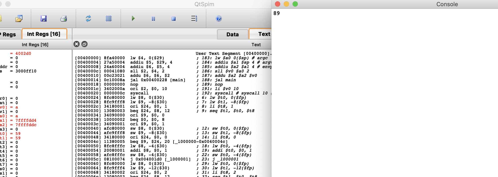

第11项为89正确。

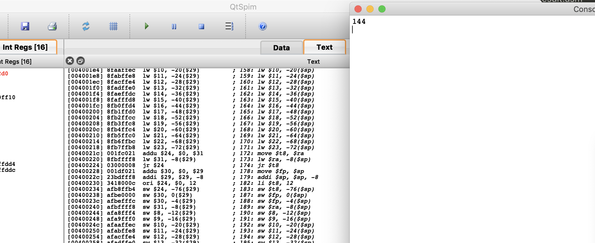

第12项为144，正确(1,1,2,3,5,8,13,21,34,55,89,144)

### 测试2：test4.spl

测试案例4是一个引用传递加上递归调用的算阶乘的累加的例子。其中穿过scope访问当了k，并且传递的也是引用传递k。所以在每次`b := b + go;`和`k := k + go;`中都会加上自己。

```pascal
program hello;
var	
	f : integer;
	k : integer;
function go(var b : integer; a : integer): integer;
var 
	fk : integer;
	t : real;
begin
	if a > 0 then 
	begin
		go := a * go(b , a - 1);
	end
	else
	begin
		go := 1;
	end
	;
	b := b + go;
	k := k + go;
end
;

begin
	k := 0;
	f := go(k , 5);
	writeln(f);
	writeln(k);
end
.
```

##### 中间代码

```
# 0 LABEL go main.go None
# 1 > Symbol(`_t000000`, boolean, var, 20) Symbol(`a`, integer, var, 4) 0
# 2 BEQ _l000000 Symbol(`_t000000`, boolean, var, 20) False
# 3 - Symbol(`_t000001`, integer, var, 24) Symbol(`a`, integer, var, 4) 1
# 4 REFER None Symbol(`b`, integer, var, 0, *) None
# 5 PARAM None Symbol(`_t000001`, integer, var, 24) None
# 6 CALL Symbol(`_t000002`, integer, var, 28) go main
# 7 * Symbol(`_t000003`, integer, var, 32) Symbol(`a`, integer, var, 4) Symbol(`_t000002`, integer, var, 28)
# 8 + Symbol(`_return`, integer, var, 8, [('b', 'integer', True), ('a', 'integer', False)]) Symbol(`_t000003`, integer, var, 32) 0
# 9 JMP _l000001 None None
#10 LABEL _l000000 None None
#11 + Symbol(`_return`, integer, var, 8, [('b', 'integer', True), ('a', 'integer', False)]) 1 0
#12 LABEL _l000001 None None
#13 + Symbol(`_t000004`, integer, var, 36) Symbol(`b`, integer, var, 0, *) Symbol(`_return`, integer, var, 8, [('b', 'integer', True), ('a', 'integer', False)])
#14 + Symbol(`b`, integer, var, 0, *) Symbol(`_t000004`, integer, var, 36) 0
#15 + Symbol(`_t000005`, integer, var, 40) Symbol(`k`, integer, var, 4) Symbol(`_return`, integer, var, 8, [('b', 'integer', True), ('a', 'integer', False)])
#16 + Symbol(`k`, integer, var, 4) Symbol(`_t000005`, integer, var, 40) 0
#17 RETURN Symbol(`_return`, integer, var, 8, [('b', 'integer', True), ('a', 'integer', False)]) main.go None
#18 LABEL main None None
#19 + Symbol(`k`, integer, var, 4) 0 0
#20 REFER None Symbol(`k`, integer, var, 4) None
#21 PARAM None 5 None
#22 CALL Symbol(`_t000000`, integer, var, 8) go main
#23 + Symbol(`f`, integer, var, 0) Symbol(`_t000000`, integer, var, 8) 0
#24 PRINT None Symbol(`f`, integer, var, 0) None
#25 PRINTLN None None None
#26 PRINT None Symbol(`k`, integer, var, 4) None
#27 PRINTLN None None None
```

##### 目标代码

```

# 0 LABEL go main.go None
go:

# 1 > Symbol(`_t000000`, boolean, var, 20) Symbol(`a`, integer, var, 4) 0
lw $t0, -4($fp)
lw $t1, -20($fp)
li $t8, 0
sgt $t1, $t0, $t8

# 2 BEQ _l000000 Symbol(`_t000000`, boolean, var, 20) False
sw $t0, -4($fp)
sw $t1, -20($fp)
li $t8, 0
beq $t1, $t8, _l000000

# 3 - Symbol(`_t000001`, integer, var, 24) Symbol(`a`, integer, var, 4) 1
lw $t0, -4($fp)
lw $t1, -24($fp)
li $t8, 1
sub $t1, $t0, $t8

# 4 REFER None Symbol(`b`, integer, var, 0, *) None
sw $t0, -4($fp)
sw $t1, -24($fp)
lw $t9, 0($fp) 
lw $t0, 0($t9)

# pass value because it is an address already. 
lw $t9, 0($fp)
sw $t9, -76($sp)
lw $t9, 0($fp) 
sw $t0, 0($t9)

# 5 PARAM None Symbol(`_t000001`, integer, var, 24) None
lw $t0, -24($fp)
sw $t0, -80($sp)

# 6 CALL Symbol(`_t000002`, integer, var, 28) go main
sw $t0, -24($fp)
# = parent's
lw $t8, 76($fp)
sw $t8, 0($sp)
sw $fp, -4($sp)
sw $ra, -8($sp)
sw $8, -12($sp)
sw $9, -16($sp)
sw $10, -20($sp)
sw $11, -24($sp)
sw $12, -28($sp)
sw $13, -32($sp)
sw $14, -36($sp)
sw $15, -40($sp)
sw $16, -44($sp)
sw $17, -48($sp)
sw $18, -52($sp)
sw $19, -56($sp)
sw $20, -60($sp)
sw $21, -64($sp)
sw $22, -68($sp)
sw $23, -72($sp)
addi $fp $sp -76
addi $sp $sp -120
jal go
lw $t0, -28($fp)
move, $t0, $v0
sw $t0, -28($fp)

# 7 * Symbol(`_t000003`, integer, var, 32) Symbol(`a`, integer, var, 4) Symbol(`_t000002`, integer, var, 28)
lw $t0, -4($fp)
lw $t1, -28($fp)
lw $t2, -32($fp)
mul $t2, $t0, $t1

# 8 + Symbol(`_return`, integer, var, 8, [('b', 'integer', True), ('a', 'integer', False)]) Symbol(`_t000003`, integer, var, 32) 0
lw $t3, -8($fp)
li $t8, 0
add $t3, $t2, $t8

# 9 JMP _l000001 None None
sw $t0, -4($fp)
sw $t1, -28($fp)
sw $t2, -32($fp)
sw $t3, -8($fp)
j _l000001

# 10 LABEL _l000000 None None
_l000000:

# 11 + Symbol(`_return`, integer, var, 8, [('b', 'integer', True), ('a', 'integer', False)]) 1 0
lw $t0, -8($fp)
addi $t0, $0, 1
sw $t0, -8($fp)

# 12 LABEL _l000001 None None
_l000001:

# 13 + Symbol(`_t000004`, integer, var, 36) Symbol(`b`, integer, var, 0, *) Symbol(`_return`, integer, var, 8, [('b', 'integer', True), ('a', 'integer', False)])
lw $t9, 0($fp) 
lw $t0, 0($t9)
lw $t1, -8($fp)
lw $t2, -36($fp)
add $t2, $t0, $t1
lw $t9, 0($fp) 
sw $t0, 0($t9)
sw $t1, -8($fp)
sw $t2, -36($fp)

# 14 + Symbol(`b`, integer, var, 0, *) Symbol(`_t000004`, integer, var, 36) 0
lw $t0, -36($fp)
lw $t9, 0($fp) 
lw $t1, 0($t9)
li $t8, 0
add $t1, $t0, $t8
sw $t0, -36($fp)
lw $t9, 0($fp) 
sw $t1, 0($t9)

# 15 + Symbol(`_t000005`, integer, var, 40) Symbol(`k`, integer, var, 4) Symbol(`_return`, integer, var, 8, [('b', 'integer', True), ('a', 'integer', False)])
move $t9, $fp
lw $t9, 76($t9)
lw $t0, -4($t9)
lw $t1, -8($fp)
lw $t2, -40($fp)
add $t2, $t0, $t1

# 16 + Symbol(`k`, integer, var, 4) Symbol(`_t000005`, integer, var, 40) 0
li $t8, 0
add $t0, $t2, $t8

# 17 RETURN Symbol(`_return`, integer, var, 8, [('b', 'integer', True), ('a', 'integer', False)]) main.go None
move $t9, $fp
lw $t9, 76($t9)
sw $t0, -4($t9)
sw $t1, -8($fp)
sw $t2, -40($fp)
lw $v0, -8($fp)
addi $sp, $sp, 120
lw $fp, 72($fp)
lw $8, -12($sp)
lw $9, -16($sp)
lw $10, -20($sp)
lw $11, -24($sp)
lw $12, -28($sp)
lw $13, -32($sp)
lw $14, -36($sp)
lw $15, -40($sp)
lw $16, -44($sp)
lw $17, -48($sp)
lw $18, -52($sp)
lw $19, -56($sp)
lw $20, -60($sp)
lw $21, -64($sp)
lw $22, -68($sp)
lw $23, -72($sp)
move $t8, $ra
lw $ra, -8($sp)
jr $t8

# 18 LABEL main None None
main:
move $fp, $sp
addi $sp, $sp, -12

# 19 + Symbol(`k`, integer, var, 4) 0 0
lw $t0, -4($fp)
addi $t0, $0, 0

# 20 REFER None Symbol(`k`, integer, var, 4) None

# pass address.
addi $t8, $fp, -4
sw $t8, -76($sp)

# 21 PARAM None 5 None
li $t8, 5
sw $t8, -80($sp)

# 22 CALL Symbol(`_t000000`, integer, var, 8) go main
sw $t0, -4($fp)
# = fp
sw $fp, 0($sp)
sw $fp, -4($sp)
sw $ra, -8($sp)
sw $8, -12($sp)
sw $9, -16($sp)
sw $10, -20($sp)
sw $11, -24($sp)
sw $12, -28($sp)
sw $13, -32($sp)
sw $14, -36($sp)
sw $15, -40($sp)
sw $16, -44($sp)
sw $17, -48($sp)
sw $18, -52($sp)
sw $19, -56($sp)
sw $20, -60($sp)
sw $21, -64($sp)
sw $22, -68($sp)
sw $23, -72($sp)
addi $fp $sp -76
addi $sp $sp -120
jal go
lw $t0, -8($fp)
move, $t0, $v0
sw $t0, -8($fp)

# 23 + Symbol(`f`, integer, var, 0) Symbol(`_t000000`, integer, var, 8) 0
lw $t0, -8($fp)
lw $t1, 0($fp)
li $t8, 0
add $t1, $t0, $t8

# 24 PRINT None Symbol(`f`, integer, var, 0) None
li $v0, 1
addi $a0, $t1, 0
syscall

# 25 PRINTLN None None None
li $v0, 11
addi $a0, $0, 10
syscall

# 26 PRINT None Symbol(`k`, integer, var, 4) None
lw $t2, -4($fp)
li $v0, 1
addi $a0, $t2, 0
syscall

# 27 PRINTLN None None None
li $v0, 11
addi $a0, $0, 10
syscall
sw $t0, -8($fp)
sw $t1, 0($fp)
sw $t2, -4($fp)
li $v0, 10
syscall
```

##### 模拟器测试

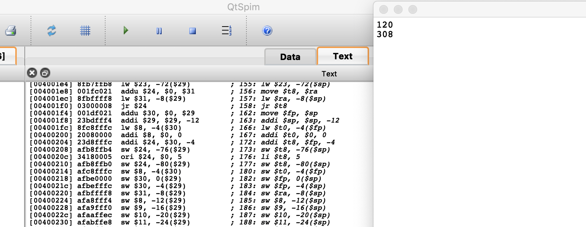

结果正确

### 测试3：test6.spl

测试3是一个计算GCD的例子，也就是最大公因数，将两组数的最大公因数乘起来。会使用到函数调用和递归。

```pascal
program hello;
var 
	ans : integer;

function gcd(a, b : integer) : integer;
begin
	if b = 0 then begin
		gcd := a;
	end
	else begin
		gcd := gcd(b , a MOD b);
	end
	;
end
;

begin
	ans := gcd(9 , 36) * gcd(3 , 6);
	writeln(ans);
end
.
```

[注]在老师给的代码中中间的MOD的位置是%，但是事实上在SPL的定义中并没有这个符号。

##### 中间代码

```
# 0 LABEL gcd main.gcd None
# 1 = Symbol(`_t000000`, boolean, var, 12) Symbol(`b`, integer, var, 4) 0
# 2 BEQ _l000000 Symbol(`_t000000`, boolean, var, 12) False
# 3 + Symbol(`_return`, integer, var, 8, [('a', 'integer', False), ('b', 'integer', False)]) Symbol(`a`, integer, var, 0) 0
# 4 JMP _l000001 None None
# 5 LABEL _l000000 None None
# 6 MOD Symbol(`_t000001`, integer, var, 16) Symbol(`a`, integer, var, 0) Symbol(`b`, integer, var, 4)
# 7 PARAM None Symbol(`b`, integer, var, 4) None
# 8 PARAM None Symbol(`_t000001`, integer, var, 16) None
# 9 CALL Symbol(`_t000002`, integer, var, 20) gcd main
#10 + Symbol(`_return`, integer, var, 8, [('a', 'integer', False), ('b', 'integer', False)]) Symbol(`_t000002`, integer, var, 20) 0
#11 LABEL _l000001 None None
#12 RETURN Symbol(`_return`, integer, var, 8, [('a', 'integer', False), ('b', 'integer', False)]) main.gcd None
#13 LABEL main None None
#14 PARAM None 9 None
#15 PARAM None 36 None
#16 CALL Symbol(`_t000000`, integer, var, 4) gcd main
#17 PARAM None 3 None
#18 PARAM None 6 None
#19 CALL Symbol(`_t000001`, integer, var, 8) gcd main
#20 * Symbol(`_t000002`, integer, var, 12) Symbol(`_t000000`, integer, var, 4) Symbol(`_t000001`, integer, var, 8)
#21 + Symbol(`ans`, integer, var, 0) Symbol(`_t000002`, integer, var, 12) 0
#22 PRINT None Symbol(`ans`, integer, var, 0) None
#23 PRINTLN None None Non
```

##### 目标代码

```

# 0 LABEL gcd main.gcd None
gcd:

# 1 = Symbol(`_t000000`, boolean, var, 12) Symbol(`b`, integer, var, 4) 0
lw $t0, -4($fp)
lw $t1, -12($fp)
li $t8, 0
seq $t1, $t0, $t8

# 2 BEQ _l000000 Symbol(`_t000000`, boolean, var, 12) False
sw $t0, -4($fp)
sw $t1, -12($fp)
li $t8, 0
beq $t1, $t8, _l000000

# 3 + Symbol(`_return`, integer, var, 8, [('a', 'integer', False), ('b', 'integer', False)]) Symbol(`a`, integer, var, 0) 0
lw $t0, 0($fp)
lw $t1, -8($fp)
li $t8, 0
add $t1, $t0, $t8

# 4 JMP _l000001 None None
sw $t0, 0($fp)
sw $t1, -8($fp)
j _l000001

# 5 LABEL _l000000 None None
_l000000:

# 6 MOD Symbol(`_t000001`, integer, var, 16) Symbol(`a`, integer, var, 0) Symbol(`b`, integer, var, 4)
lw $t0, 0($fp)
lw $t1, -4($fp)
lw $t2, -16($fp)
div $t0, $t1
mfhi $t2

# 7 PARAM None Symbol(`b`, integer, var, 4) None
sw $t1, -76($sp)

# 8 PARAM None Symbol(`_t000001`, integer, var, 16) None
sw $t2, -80($sp)

# 9 CALL Symbol(`_t000002`, integer, var, 20) gcd main
sw $t0, 0($fp)
sw $t1, -4($fp)
sw $t2, -16($fp)
# = parent's
lw $t8, 76($fp)
sw $t8, 0($sp)
sw $fp, -4($sp)
sw $ra, -8($sp)
sw $8, -12($sp)
sw $9, -16($sp)
sw $10, -20($sp)
sw $11, -24($sp)
sw $12, -28($sp)
sw $13, -32($sp)
sw $14, -36($sp)
sw $15, -40($sp)
sw $16, -44($sp)
sw $17, -48($sp)
sw $18, -52($sp)
sw $19, -56($sp)
sw $20, -60($sp)
sw $21, -64($sp)
sw $22, -68($sp)
sw $23, -72($sp)
addi $fp $sp -76
addi $sp $sp -100
jal gcd
lw $t0, -20($fp)
move, $t0, $v0
sw $t0, -20($fp)

# 10 + Symbol(`_return`, integer, var, 8, [('a', 'integer', False), ('b', 'integer', False)]) Symbol(`_t000002`, integer, var, 20) 0
lw $t0, -20($fp)
lw $t1, -8($fp)
li $t8, 0
add $t1, $t0, $t8
sw $t0, -20($fp)
sw $t1, -8($fp)

# 11 LABEL _l000001 None None
_l000001:

# 12 RETURN Symbol(`_return`, integer, var, 8, [('a', 'integer', False), ('b', 'integer', False)]) main.gcd None
lw $v0, -8($fp)
addi $sp, $sp, 100
lw $fp, 72($fp)
lw $8, -12($sp)
lw $9, -16($sp)
lw $10, -20($sp)
lw $11, -24($sp)
lw $12, -28($sp)
lw $13, -32($sp)
lw $14, -36($sp)
lw $15, -40($sp)
lw $16, -44($sp)
lw $17, -48($sp)
lw $18, -52($sp)
lw $19, -56($sp)
lw $20, -60($sp)
lw $21, -64($sp)
lw $22, -68($sp)
lw $23, -72($sp)
move $t8, $ra
lw $ra, -8($sp)
jr $t8

# 13 LABEL main None None
main:
move $fp, $sp
addi $sp, $sp, -16

# 14 PARAM None 9 None
li $t8, 9
sw $t8, -76($sp)

# 15 PARAM None 36 None
li $t8, 36
sw $t8, -80($sp)

# 16 CALL Symbol(`_t000000`, integer, var, 4) gcd main
# = fp
sw $fp, 0($sp)
sw $fp, -4($sp)
sw $ra, -8($sp)
sw $8, -12($sp)
sw $9, -16($sp)
sw $10, -20($sp)
sw $11, -24($sp)
sw $12, -28($sp)
sw $13, -32($sp)
sw $14, -36($sp)
sw $15, -40($sp)
sw $16, -44($sp)
sw $17, -48($sp)
sw $18, -52($sp)
sw $19, -56($sp)
sw $20, -60($sp)
sw $21, -64($sp)
sw $22, -68($sp)
sw $23, -72($sp)
addi $fp $sp -76
addi $sp $sp -100
jal gcd
lw $t0, -4($fp)
move, $t0, $v0
sw $t0, -4($fp)

# 17 PARAM None 3 None
li $t8, 3
sw $t8, -76($sp)

# 18 PARAM None 6 None
li $t8, 6
sw $t8, -80($sp)

# 19 CALL Symbol(`_t000001`, integer, var, 8) gcd main
# = fp
sw $fp, 0($sp)
sw $fp, -4($sp)
sw $ra, -8($sp)
sw $8, -12($sp)
sw $9, -16($sp)
sw $10, -20($sp)
sw $11, -24($sp)
sw $12, -28($sp)
sw $13, -32($sp)
sw $14, -36($sp)
sw $15, -40($sp)
sw $16, -44($sp)
sw $17, -48($sp)
sw $18, -52($sp)
sw $19, -56($sp)
sw $20, -60($sp)
sw $21, -64($sp)
sw $22, -68($sp)
sw $23, -72($sp)
addi $fp $sp -76
addi $sp $sp -100
jal gcd
lw $t0, -8($fp)
move, $t0, $v0
sw $t0, -8($fp)

# 20 * Symbol(`_t000002`, integer, var, 12) Symbol(`_t000000`, integer, var, 4) Symbol(`_t000001`, integer, var, 8)
lw $t0, -4($fp)
lw $t1, -8($fp)
lw $t2, -12($fp)
mul $t2, $t0, $t1

# 21 + Symbol(`ans`, integer, var, 0) Symbol(`_t000002`, integer, var, 12) 0
lw $t3, 0($fp)
li $t8, 0
add $t3, $t2, $t8

# 22 PRINT None Symbol(`ans`, integer, var, 0) None
li $v0, 1
addi $a0, $t3, 0
syscall

# 23 PRINTLN None None None
li $v0, 11
addi $a0, $0, 10
syscall
sw $t0, -4($fp)
sw $t1, -8($fp)
sw $t2, -12($fp)
sw $t3, 0($fp)
li $v0, 10
syscall
```

##### 模拟器运行

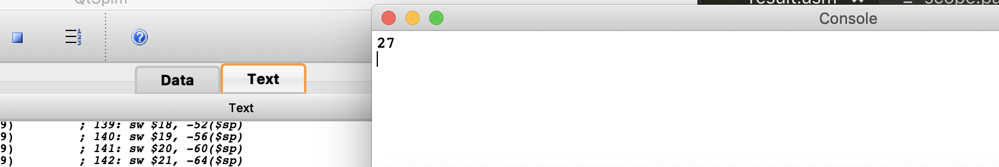

源程序是`ans := gcd(9 , 36) * gcd(3 , 6);`，可以看出前是9，后者是3，所以乘起来是27。

如果修改数据为`ans := gcd(12, 144) * gcd(5 , 7);`。结果应该是12 * 1等于12。

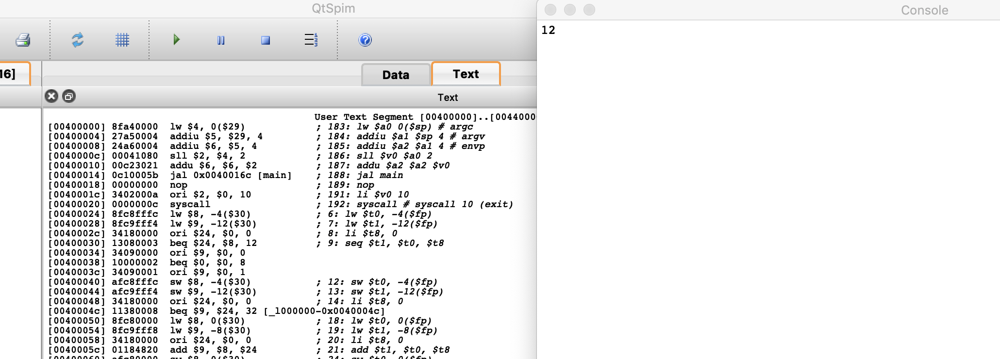

正确。

## 优化与展望

在目标代码生成的过程中，为了避免在处理控制流时出现的变量值的异步问题，我们的策略是在每一个block结束后把当前寄存器中的值存回内存并清空寄存器，但并不是所有变量都存在异步的问题，这样就带来了对内存访问次数的增加，从而影响程序效率。一个比较好的解决办法是可以根据基本块构造的流图做优化，根据流图中每个节点的前后节点判断变量的使用情况，从而决定变量要不要存回内存。用流图还可以做代码冗余的优化，如果有重复赋值的情况存在，则可以将后面出现的新变量用旧变量代替，从而减少代码量。


## 附1： 分工

- 词法分析，语法分析，AST：任宇凡
- 中间代码生成，寄存器分配，代码优化：刘洪甫
- 目标代码生成，符号表：邱兆林
- 说明：很多内容，包括调试在内，是一同完成的，以上分工只是主要负责

## 附2：工程代码

说明：工程代码实在太长，我们尝试过加到文档内，至少有70页，为了节省空间，还请查看一同提交的工程文件夹